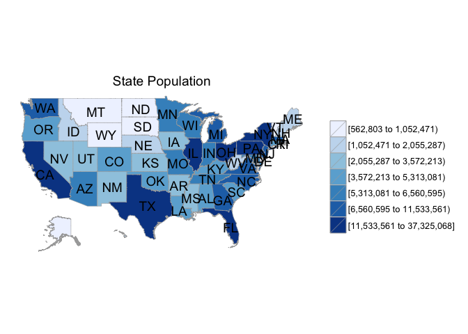
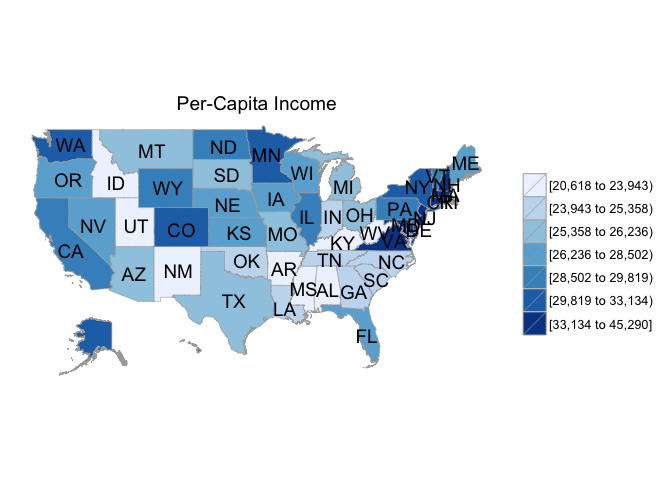
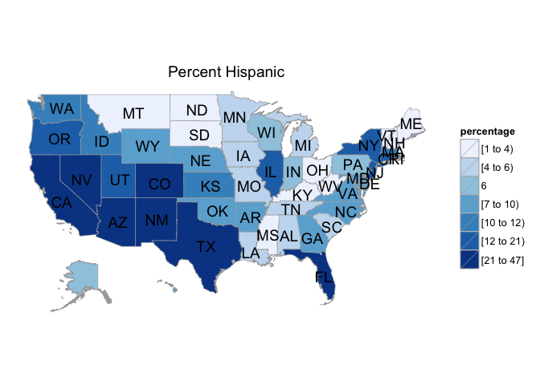
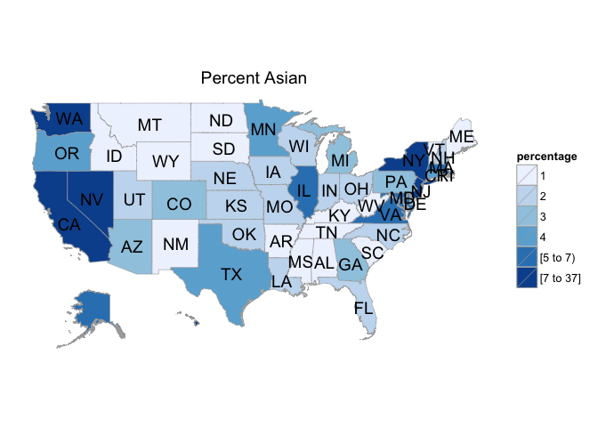
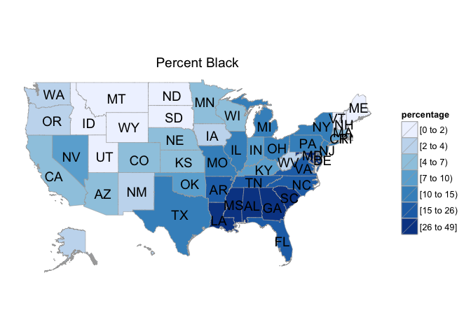
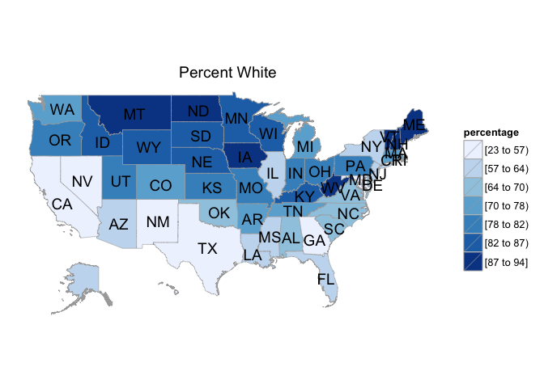

# Maps of State Demographics in the US for 2012.
David Clark  
October 6, 2015  

Load the libraries:


```r
library(choroplethr)
library(choroplethrMaps)
```

Look at the data for state population:


```r
data("df_pop_state")
head(df_pop_state)
```

```
##       region    value
## 1    alabama  4777326
## 2     alaska   711139
## 3    arizona  6410979
## 4   arkansas  2916372
## 5 california 37325068
## 6   colorado  5042853
```

Create choropleth map of US state populations:


```r
state_choropleth(df_pop_state, title = "State Population")
```

 

Create a choropleth map of per-capita income for each state.

First, lets look at the data:


```r
data("df_state_demographics")
colnames(df_state_demographics)
```

```
## [1] "region"            "total_population"  "percent_white"    
## [4] "percent_black"     "percent_asian"     "percent_hispanic" 
## [7] "per_capita_income" "median_rent"       "median_age"
```

Now, lets make the map:


```r
df_state_demographics$value = df_state_demographics$per_capita_income
state_choropleth(df_state_demographics, title="Per-Capita Income")
```

 

Map of the percentage of the state population that is **hispanic**:


```r
df_state_demographics$value = df_state_demographics$percent_hispanic
state_choropleth(df_state_demographics, title = "Percent Hispanic", legend = "percentage")
```

 

Map of the percentage of the state population that is **asian**:


```r
df_state_demographics$value = df_state_demographics$percent_asian
state_choropleth(df_state_demographics, title = "Percent Asian", legend = "percentage")
```

 

Map of the percentage of the state population that is **black**:


```r
df_state_demographics$value = df_state_demographics$percent_black
state_choropleth(df_state_demographics, title = "Percent Black", legend = "percentage")
```

 

Map of the percentage of the state population that is **white**:


```r
df_state_demographics$value = df_state_demographics$percent_white
state_choropleth(df_state_demographics, title = "Percent White", legend = "percentage")
```

 
